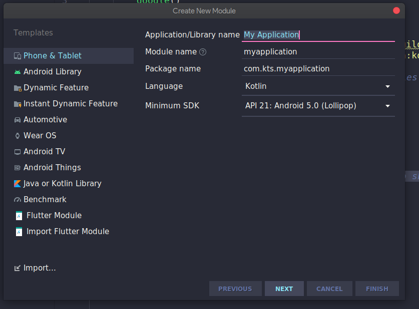
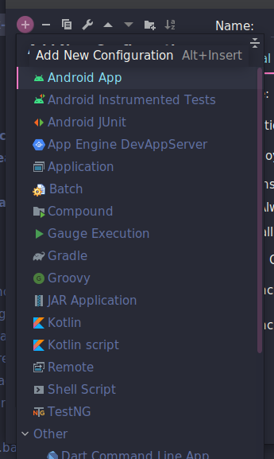
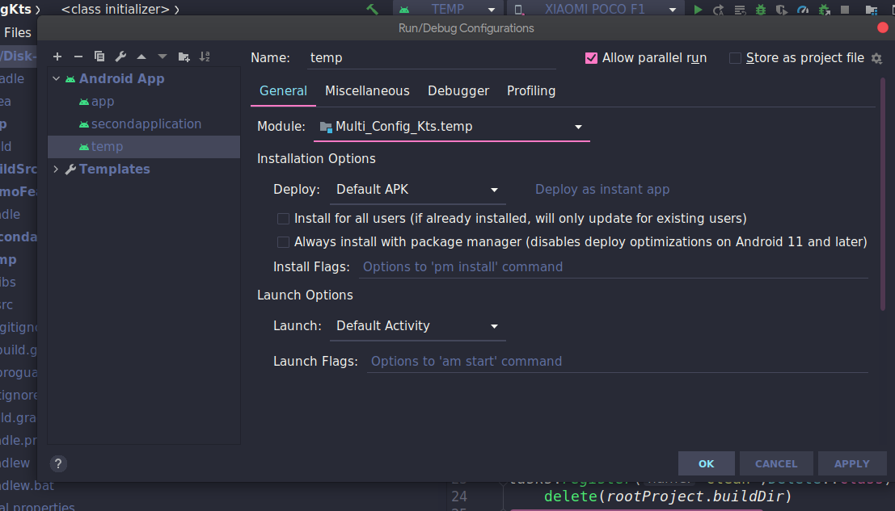

#### Mutli configuration Android Studio: Kotlin DSL

Assuming all the modules and features use kotlin dsl

If we need to convert a groovy to Kotlin DSL [this](https://proandroiddev.com/migrate-to-gradle-kotlin-dsl-in-4-steps-f3e3b27e1f4d) article is helpfull

As per this project:

There are 3 application configuration:
:app
:secondapplication
:temp

All of them are created using creating a module type of either of 
**Android Library and Phone & Tablet** as shown in the below image.

The application configuration :app is the default one in the project.
the other app configurations (:secondapplication & :temp) are created by the following process.

After we create a module of the first two types they are automatically recognized by android studio as a configuration and are added in the play dropdown menu. Consisting of the files, manifest, classes as described in their respective gradle configuration.

A feature or android library cannot be added as a configuration.(not sure, doesn't make sense, even if you made one won't be runnable and it gives an error "The module cannot be a library")

> A module can be added as a configuration in android studio.\

- Going in the edit configurations settings from the drop down,
- Add a new configuration using the top left + icon, of type android app

- select your module and further details which include (Module Title, etc, default activity, default apk, etc)

Hurray!, new app configuration is created. 
Find you new configuration on the dropdown.

